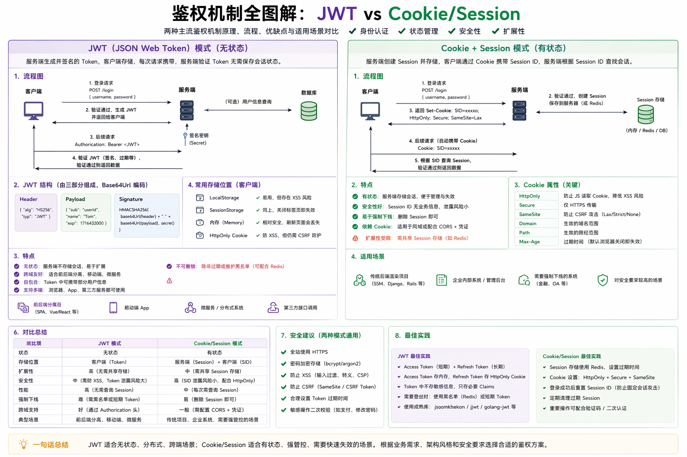

# JWT（JSON Web Token）



***

## 一、背景问题

**为什么需要 JWT？**

HTTP 是**无状态**协议——每次请求都是独立的，服务端不知道这个请求是谁发来的。

### Session 方案的痛点

传统方案是 Session：

```
用户登录 → 服务端创建 Session，存一份到内存/Redis → 返回 SessionID 写入 Cookie
下次请求 → 带上 Cookie → 服务端查 Session 确认身份
```

在**单体应用**下 Session 没问题，但在**分布式/微服务**场景下暴露三个问题：

1. **Session 共享难** — 用户请求到 A 服务，下次可能到 B 服务，B 没有这个 Session。需要引入 Redis 集中存储或粘性会话
2. **跨域支持差** — Cookie 受同源策略限制，移动端、第三方应用不方便
3. **扩展性受限** — Session 存储量随用户数线性增长，服务端有状态

> JWT 的出现就是为了解决这些问题——**把身份信息从服务端移到客户端**。

***

## 二、前置理解

### HTTP 无状态

每个 HTTP 请求是独立的，服务端处理完请求后不会记住这个连接的任何信息。因此需要一种**每次请求都携带**的身份认证机制来识别用户。

### Session 认证流程

```
               ① 登录（账号+密码）
客户端 ──────────────────────────→ 服务端
                                         │ ② 创建 Session，存 Redis
                                         │ ③ 返回 SessionID
      ④ 设置 Cookie（HttpOnly） ←────────
      ⑤ 请求时自动带 Cookie ─────────────→ ⑥ 查 Session 确认身份
```

**特点**：身份信息存在服务端，客户端只存一个 SessionID。

### Token 认证流程

```
               ① 登录（账号+密码）
客户端 ──────────────────────────→ 服务端
                                         │ ② 验证身份
                                         │ ③ 签发 Token（含用户信息 + 签名）
      ④ 保存 Token ←───────────────
      ⑤ 请求时在 Header 带 Token ───────→ ⑥ 验签，解析用户信息
```

**特点**：身份信息存在 Token 里，服务端只需验签，不需要查存储。   敏感信息严禁进入token

***

## 三、核心原理

### JWT 的三大保障    

| 保障                    | 说明            | 实现方式                 |
| --------------------- | ------------- | -------------------- |
| **完整性（Integrity）**    | token 内容未被篡改  | Signature 签名校验       |
| **合法性（Authenticity）** | token 确由可信方签发 | 持有 secret/私钥才能生成合法签名 |
| **时效性（Timeliness）**   | token 过期后自动失效 | Payload 中的 exp 声明    |

绝对注意，是没有https 那种加密型的，   jwt本身没有加密

### 三段结构：Header.Payload.Signature

一个 JWT 形如：`xxxxx.yyyyy.zzzzz`

#### Header（头部）

```json
{
  "alg": "HS256",    // 签名算法，常用 HS256（对称）或 RS256（非对称）
  "typ": "JWT"       // 令牌类型，固定为 JWT
}
```

#### Payload（载荷）——存放用户信息与声明

```json
{
  "iss": "auth-service",         // 签发者
  "sub": "user_123",             // 面向的用户
  "aud": "order-service",        // 接收方
  "exp": 1700000000,             // 过期时间（必填！）
  "nbf": 1699996400,             // 生效时间
  "iat": 1699996400,             // 签发时间
  "jti": "unique-id-xxx",        // 唯一标识，防重放
  "user_id": 123,                // 自定义声明
  "role": "admin"                // 自定义声明
}
```

**注意**：Payload 是 Base64Url 编码，**不是加密**，任何人都能解码看到内容。

#### Signature（签名）

```
signature = HMACSHA256(
    base64UrlEncode(header) + "." + base64UrlEncode(payload),
    secret
)
```

**为什么能防篡改？**

攻击者改了 Payload 里的 `user_id`，服务端验签时重新计算 Signature，发现和 Token 里的 Signature 对不上——**拒绝请求**。

### 对称 vs 非对称

| <br /> | HS256（对称）         | RS256（非对称）  |
| ------ | ----------------- | ----------- |
| 密钥     | 一个 secret，签发和验证共用 | 私钥签发，公钥验证   |
| 安全     | secret 泄露全完蛋      | 私钥不传递，更安全   |
| 性能     | 更快                | 稍慢          |
| 适用     | 单体应用、前后端分离        | 微服务、第三方开放平台 |

### 完整流程

**签名流程（登录时）：**

```
① 用户提交账号密码
② 服务端验证通过
③ 组装 Header + Payload（含 exp）
④ 用 secret 对 Header.Payload 进行 HMACSHA256 签名
⑤ 生成完整 Token：Header.Payload.Signature
⑥ 返回 Token 给客户端
```

**校验流程（请求时）：**

```
① 客户端在 Authorization Header 带上 Token
② 服务端拆分 Token 为 Header.Payload.Signature
③ 对 Header.Payload 重新计算签名
④ 比对计算出的签名和 Token 中的 Signature
   └─ 一致 → 通过，解析 Payload 获取用户信息
   └─ 不一致 → 拒绝请求
⑤ 检查 exp 是否过期
   └─ 未过期 → 放行
   └─ 已过期 → 返回 401
```

***

## 四、特点

### Session vs JWT 对比

| 维度       | Session                    | JWT                  |
| -------- | -------------------------- | -------------------- |
| **存储位置** | 服务端（内存/Redis）              | 客户端（Token 本身）        |
| **扩展性**  | 需要共享 Session 存储（Redis）     | 天然无状态，水平扩展容易         |
| **主动失效** | 服务端删 Session 即可            | 无法主动撤销（需黑名单兜底）       |
| **跨域**   | 依赖 Cookie，受同源策略限制          | 自包含，Header 手动携带，跨域友好 |
| **性能**   | 每次请求需查存储（Redis O(1)）       | 解析 Token，不需要查存储      |
| **体积**   | Cookie 里只存 SessionID（小）    | Token 包含所有用户信息（较大）   |
| **安全性**  | SessionID 泄露后服务端可删 Session | Token 泄露后在有效期内可任意使用  |

### 一句话总结

- **Session**：服务端有状态，凭 SessionID 查用户信息
- **JWT**：服务端无状态，Token 自包含用户信息，验签即可

***

## 五、工程实践

### 基础实现

**生成 Token（Go + jwt-go 库）：**

```go
type Claims struct {
    UserID int    `json:"user_id"`
    Role   string `json:"role"`
    jwt.RegisteredClaims
}

func GenerateToken(userID int, role string) (string, error) {
    claims := Claims{
        UserID: userID,
        Role:   role,
        RegisteredClaims: jwt.RegisteredClaims{
            ExpiresAt: jwt.NewNumericDate(time.Now().Add(15 * time.Minute)),
            IssuedAt:  jwt.NewNumericDate(time.Now()),
            Issuer:    "my-service",
        },
    }
    token := jwt.NewWithClaims(jwt.SigningMethodHS256, claims)
    return token.SignedString([]byte("your-secret-key"))
}
```

**验证 Token（中间件）：**

```go
func AuthMiddleware(secret string) gin.HandlerFunc {
    return func(c *gin.Context) {
        tokenStr := c.GetHeader("Authorization")
        if tokenStr == "" || !strings.HasPrefix(tokenStr, "Bearer ") {
            c.AbortWithStatusJSON(401, gin.H{"error": "未登录"})
            return
        }
        tokenStr = strings.TrimPrefix(tokenStr, "Bearer ")

        claims := &Claims{}
        token, err := jwt.ParseWithClaims(tokenStr, claims, func(t *jwt.Token) (interface{}, error) {
            return []byte(secret), nil
        })
        if err != nil || !token.Valid {
            c.AbortWithStatusJSON(401, gin.H{"error": "Token 无效或已过期"})
            return
        }
        c.Set("user_id", claims.UserID)
        c.Set("role", claims.Role)
        c.Next()
    }
}
```

### Access Token + Refresh Token 机制

解决 JWT **不可撤销 + 过期时间两难**的问题（过期太短体验差，过期太长不安全）。

| <br /> | Access Token       | Refresh Token                       |
| ------ | ------------------ | ----------------------------------- |
| 过期时间   | **短**（15 分钟）       | **长**（7 天）                          |
| 用途     | 验证身份，访问资源          | 获取新的 Access Token                   |
| 存储     | 客户端内存/localStorage | 客户端（HttpOnly Cookie 或 localStorage） |

**交互流程：**

```
                ① 登录
客户端 ──────────────────────────────→ 服务端
       ←──────── 返回双 Token ────────
                 （Access + Refresh）

                 ② 请求资源（带 Access Token）
客户端 ──────────────────────────────→ 服务端
        ←── 401（Access Token 过期） ───

                 ③ 用 Refresh Token 换取新 Access Token
客户端 ──────────────────────────────→ 服务端
       ←──── 返回新 Access Token ──────

                 ④ 用新 Token 继续请求
客户端 ──────────────────────────────→ 服务端
```

**优点：**

- Access Token 过期短 → 泄露损失有限
- Refresh Token 有效期长 → 用户不用频繁登录
- 服务端可以维护 Refresh Token 的黑名单 → 间接实现"主动撤销"能力

### 注意事项（使用时的两大坑）

**1. JWT 不保证机密性——Payload 别放敏感信息**

Payload 只是 Base64 编码，不是加密，任何人拿到 token 用在线工具就能解码看到内容。

- ❌ 错误：`{"password": "123456", "phone": "138xxxx"}`
- ✅ 正确：`{"user_id": 123, "role": "admin"}`

**2. JWT 无法主动撤销——发出后就是"泼出去的水"**

token 签发后在过期之前无法主动让其失效。如果用户 logout 或管理员封号，token 仍然是有效的。

- 解决思路：维护黑名单（redis 存失效 token）或短过期时间 + Refresh Token 机制

***

## 六、常见问题 & 注意事项

### Q1：Token 泄露了怎么办？

JWT 本身无法让已签发的 Token 失效，所以需要配套措施：

1. **短过期时间** — Access Token 15min 过期，降低损失窗口
2. **Refresh Token 黑名单** — 用户 logout 或检测到泄露时，将 Refresh Token 加入 Redis 黑名单
3. **更换 secret** — 严重泄露情况下，更换签名密钥，所有 Token 立即失效（但所有用户需要重新登录）
4. **HTTPS 传输** — 防止中间人窃取 Token

### Q2：如何实现主动失效？

| 方案                | 实现                                 | 优缺点                            |
| ----------------- | ---------------------------------- | ------------------------------ |
| **黑名单**           | Redis 存失效 Token 的 jti，校验时查         | 回到"查存储"的老路，但只在登出时查，比 Session 好 |
| **版本号**           | Redis 存用户版本号，Payload 包含版本，版本不匹配则拒绝 | 适用于强制下线场景                      |
| **短过期 + Refresh** | Access 短过期 + Refresh 可撤销           | 最常用方案，兼顾体验和安全                  |

### Q3：JWT 和单点登录（SSO）是什么关系？

JWT 天然适合做 SSO——用户在一个认证服务登录后拿到 Token，携带该 Token 访问任意子系统 （微服务），子系统只需用公钥验签即可确认身份，无需共享 Session。

```
认证中心（auth.example.com）
       │  用户登录后签发 JWT
       │
  ┌────┼──────────────┐
  │    │              │
  ▼    ▼              ▼
服务A  服务B         服务C
（公钥验签）       （公钥验签）
```

### Q4：为什么选择 HS256 还是 RS256？

- **单体项目/前后端分离** → HS256 够用，配同一个 secret
- **微服务架构** → RS256，认证服务持有私钥签发，其他服务拿公钥验证，私钥不传递
- **开放 API** → RS256，第三方也能用公钥验证 Token 真实性

### Q5：Token 放在哪里最安全？

| 存放位置                | 优点            | 缺点                        |
| ------------------- | ------------- | ------------------------- |
| **localStorage**    | 简单，手动携带       | 易受 XSS 攻击窃取               |
| **HttpOnly Cookie** | 自动发送，XSS 无法读取 | 容易受 CSRF 攻击，需加 SameSite   |
| **内存变量**            | 最安全           | 刷新页面就没了，需配合 Refresh Token |

**推荐做法**：Access Token 存内存，Refresh Token 存 HttpOnly Cookie。

### Q6：防止 token 泄露？

Token 泄露无法通过签名解决，需要**多层防线**协同：

**防线 1：源头防泄露（主动）**

- **HTTPS 传输** — 防止中间人截获 Token
- **Token 不放 localStorage** — 防止 XSS 攻击读取
- **Refresh Token 放 HttpOnly Cookie** — 即使有 XSS，JS 也拿不到                 

**防线 2：降低损失（被动）**

- **Access Token 短过期（15min）** — 泄露后损失窗口有限
- **Refresh Token 可撤销（Redis 黑名单）** — 发现泄露立即拉黑

**防线 3：检测与响应**

- **异常检测** — 同一 Token 多地使用触发告警
- **用户主动注销** — 撤销 Refresh Token，下次需重新登录
- **更换 secret** — 极端情况，全员重新登录，所有 Token 立即失效

