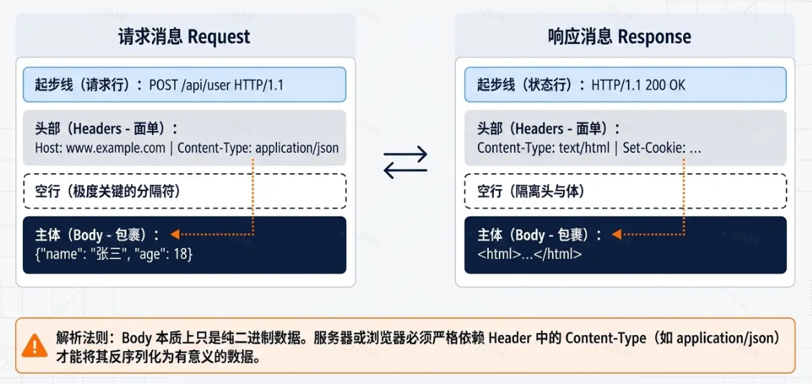
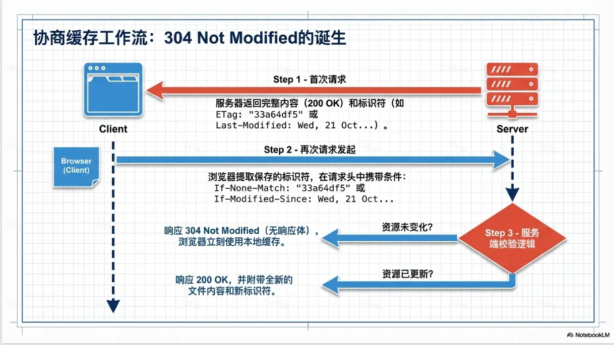
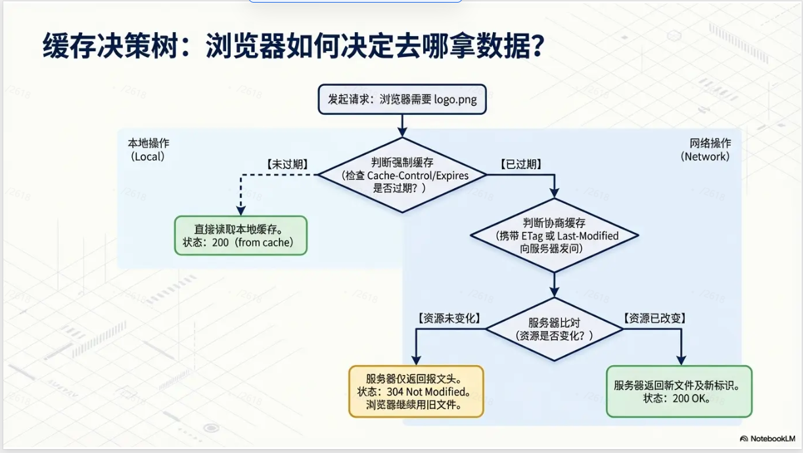
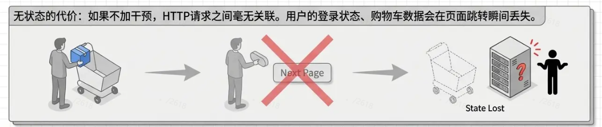

一整个链路 客户端 <-> 服务端
这中间连接就是 http协议，

HTTP 协议具有以下主要特点：
简单性：协议格式简单，易于实现和理解。
无状态性：服务器不会保存关于客户端请求的任何信息，每个请求都是独立的（注意：理解这个非常重要）。但是服务端会存储和客户端相关的信息，比如 cookie。
可扩展性：通过定义新的 HTTP 方法和头部，可以不断扩展协议的功能。
应用层协议：HTTP 运行在 TCP/IP 协议栈的应用层，使用明文传输数据，因此易于调试。

http url的组成
http url 的组成：

例如：<http://www.example.com:80/index.html?name=gopher#section1>

协议: http
域名: [www.example.com](http://www.example.com)   根据域名dns解析出对应的ip地址
端口: 80    服务器默认端口，不写也可以访问
路径: /index.html   其实就是服务端的路由地址
查询参数: name=gopher

- 这个实际提供了client向server传递信息的能力，但是 我们有body呀，甚至说是cookie，为什么还要这个呢，
  因为get请求是没有body的，然后呢cookie设计是有一定状态信息，的，这里查询参数顾名思义就是跟get搭配的

锚点: #section1   跟服务端无关，只是当 服务端返回的文件，被前端解析好后，决定到时候显示在页面的哪个位置

http消息的结构：

注意：**body本质就是二进制数据**，接收端按照Content-Type才能正确解析
http的默认基础能力（不带头信息）：
只可以发送无状态的信息，

http扩展性利刃- 给http添加头信息：
最重要的几点扩展功能：

1. 认证相关
   Authorization：客户端带上身份凭证（Token、账号密码等）
   401+WWW-Authenticate：服务端告诉客户端需要怎么认证
2. 状态 / 会话相关
   Cookie：请求时带上，用来标识用户、维持登录状态
   Set-Cookie：服务端下发，给浏览器种上 Cookie
3. 内容标识：Content-Type（告诉对方数据是 JSON / 表单 / 图片）
4. 跨域控制：Access-Control-\*（解决浏览器跨域）
5. 缓存控制：Cache-Control（控制资源是否缓存）

接下来大致介绍一下前边五个扩展功能如何实现：
注：都要从两端考虑（职责划分）

1. 认证：
   客户端：提交认证信息
   Authorization ：Bearer/Basic  + token/账号密码

服务端：对于认证错误甚至没有认证，给前端返回提示信息 状态码+响应头

- body只传输二进制数据，任何网络行为控制，都是依赖头信息 和状态码
  就是401 + WWW-Authenticate
  这里职责再次划分，
  状态码是最重要的，根据状态码判断是什么问题后，才去头里找认证信息，看需要什么格式的认证

1. 内容标识：
   除了get请求没有body，其他都具备body，这里唯一作用就是控制body的解析方式，两端没什么差异。
   所以根据传输的数据格式写好content-type就可以了，就好比文件后缀呀，有后缀，别人才知道怎么读取
   例如：content-type

- application/json
- application/x-www-form-urlencoded
- multipart/form-data

1. 缓存控制：
   前言：其实就是控制客户端的缓存行为，让请求的不频繁更新的文件缓存在客户端，避免重复请求，提高性能。

http缓存分为两类：

1. 强制缓存（你现在问的这个）
   服务端发完max-age后，就啥都不管了，客户端啥也发不了，只根据本地存储的max-age判断是否过期了

服务端：收不到请求，完全不知道你访问了，更不知道你有缓存
这就是为什么强制缓存效率极高 ——全程浏览器自己搞定，服务器零感知。

服务端返回max-age，
客户端本地保存max-age，后续请求直接用缓存

1. 协商缓存（强制缓存过期后才走）、
   二者比较标识信息，有差异就更新200
   强制缓存到期了，浏览器才会发请求，并且带上：
   If-Modified-Since
   If-None-Match
   这时候服务端才知道：哦，你客户端有旧版本缓存，然后对比一下：
   没变化 → 返回 304 Not Modified，让你继续用缓存
   有变化 → 返回 200 + 新内容

第一次请求，服务端返回Last-Modified/ETag
后续请求，客户端带上Last-Modified/ETag，服务端根据这个判断是否有变化

补充：

304 与200

4.状态持久

我们现在已经具备给服务端发送信息的能力（头信息）但是这些头信息，
我每次都是代码里写的，或者从本地获取，然后手动携带
并不可以**自动携带**

客户端也就是浏览器提供了一些机制\
cookie（浏览器控制，自动携带）

服务端实际也是两个机制：
session（会话）

cookie session的特点就是 一方发送，一方自动携带 ，很便携

状态码：帮助客户端快速判断请求的结果，进而执行后续的逻辑
例如 304 与200  304 后续不干事情，200更新资源，渲染新的资源

我们现在具备了相对强大的http能力，但是有一点问题，客户端怎么知道我这次http请求的结果呢？  就好比调用一个函数，我要知道函数的执行情况，根据情况执行后续的逻辑。
状态码就是快速告知客户端请求的结果的。不然得得一点点读取响应信息，然后判断是啥。

http中这里是状态码划分问题：
1xx：信息性状态码，表示请求已接收，继续处理。
2xx：成功状态码，表示请求已成功处理。
3xx：重定向状态码，表示需要进一步操作以完成请求。注意 301 与 302 的区别。
4xx：客户端错误状态码，表示请求包含错误。
5xx：服务器错误状态码，表示服务器处理请求出错
