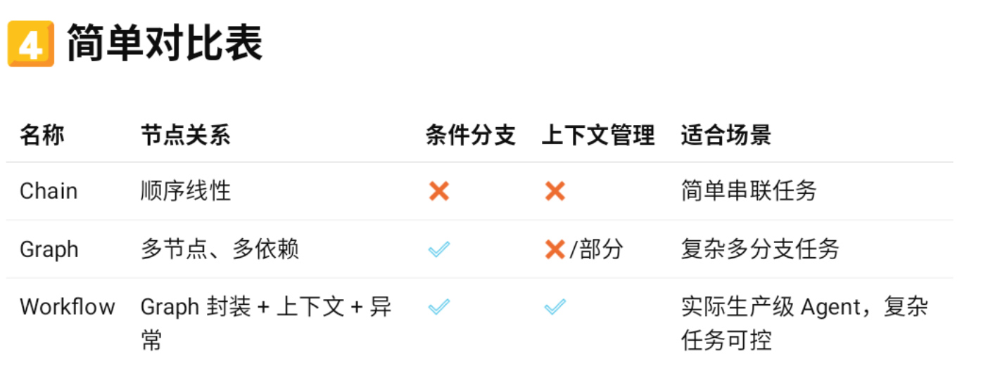

Agent基础认知

# 一,tool calling

> LLM（语言模型）本身不会做实际操作，它通过判断用户意图来调用外部工具（Tool），并把工具返回结果整合输出。

我需要做什么？
我们需要注意的就是 tool的声明和注册

## 1.为什么需要 Tool Calling

擅长语言理解与生成，判断能力强
但是执行能力弱，让他自己调用api，会有失误
解决方法：让 LLM 判断“我要做什么”，真正执行交给工具，然后把结果反馈回来。

## 2.Tool Calling 的工作流程

```
用户输入问题
       ↓
   LLM 分析意图
       ↓
   选择 Tool
       ↓
   调用工具（执行真实操作）
       ↓
   Tool 返回结果
       ↓
   LLM 整合生成回答
       ↓
     用户看到
```

## 3.Tool Calling的优势（问题）

可控性高
避免 LLM 输出错误信息
可扩展
可以随意添加新工具，不需要改模型
可追踪
Tool 调用可以记录日志，方便调试
工程化
把 LLM 和实际服务解耦，便于系统集成

# 二,Workflow / 状态管理（State Machine

## 1.为什么tool calling下一个是这个？

tool calling本身只是 单次调用，一问一答，  
很多场景当我们的任务很复杂的时候，自然需要 plan，分步骤，  这时  tool calling就只能是一个小步骤了
workflow，就是用来 管理多轮、依赖任务、分支条件的

我需要做什么？
理解工作流图（节点 + 条件 + 边）
学会用你的 Agent 框架（Eino / LangGraph）实现多步调用
管理上下文、状态转移、异常处理
  举例：
  “生成面试题 → 验证题目 → 给用户返回 → 保存记录”
  → 这就是一个简单 workflow

## 2.理解工作流图（节点 + 条件 + 边）

节点 每一步任务，例如tool调用
边   任务之间的顺序或者条件

条件  分支逻辑    （控制性的 agent）
状态转移：任务执行状态（完成 / 失败 / 重试）

完成案例

```
节点 1：用户提交简历（候选人投递岗位）
       ↓
节点 2：AI Agent 分析简历（Tool Calling: 分析技能/经验）   分支逻辑（简历完整信息 模糊， 提示候选人完善信息）
       ↓
节点 3：AI Agent 匹配岗位要求（Tool Calling: 匹配评分）
       ↓
节点 4：生成反馈 / 邮件给候选人（Tool Calling: 自动生成邮件内容）
       ↓
节点 5：保存记录到数据库 / Redis
```

## 3.Agent 框架（Eino / LangGraph）实现多步调用

核心:

1. 定义节点
2. 定义顺序
3. 定义条件

ai 生成DAG，然后，分析判断，决定最终的DAG
实践规则：

1. 节点单一职责
2. 输入输出明确
3. workflow核心顺序，条件判断，认为人为收口（查看）

### 关键问题：

节点之间如何传递数据（跨节点上下文）？ state
节点失败怎么办？
顺序，条件分支，怎么控制？  state识别，match
根据每一个节点的执行情况，state ，来判断下一个 执行哪个节点 

怎么返回workflow的结果给前端？

## 4.管理上下文、状态转移、异常处理

上下文：多轮任务要保留前面信息 → Redis / 内存
状态：每一步执行状态（成功/失败/重试）
异常处理：
工程角度：任务失败能重试 / 报错
面试可以说“保证系统鲁棒性”

## 5.这种worlflow跟 auto-planning 都是流程管理 ，差异？

Workflow = 可控、明确、多步骤 + 条件分支 → 适合你现在项目
Plan / 自动规划 = 动态生成、目标导向、自主决策 → 高级 Agent，未来方向


